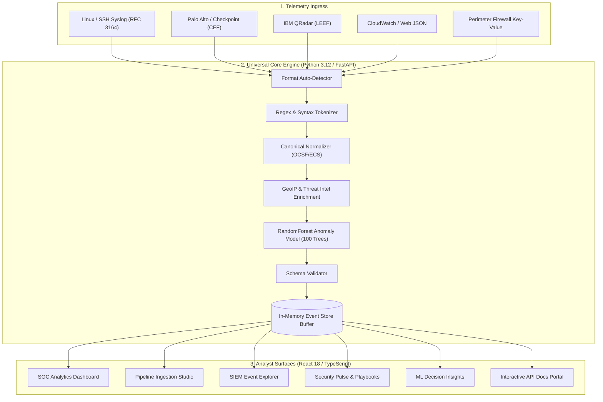
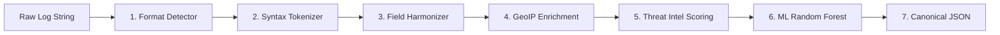
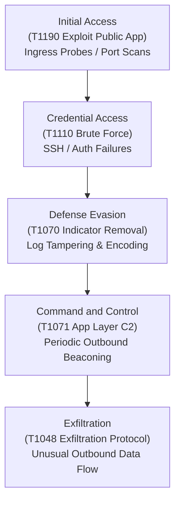

# 🛡️ Universal Log Framework (ULF)

### Vendor-Neutral Telemetry Normalization • GeoIP & Threat Intel • ML Anomaly Engine • SOC Operations Suite

[](https://my-project-sih.vercel.app/)
[](https://python.org)
[](https://fastapi.tiangolo.com)
[](https://reactjs.org)
[](https://www.typescriptlang.org)
[](https://vitejs.dev)
[](https://scikit-learn.org)
[-brightgreen?style=for-the-badge&logo=pytest&logoColor=white>)](https://pytest.org)
[](LICENSE)

---

## 📌 Table of Contents

- [1. Executive Overview](#1-executive-overview)
- [2. Problem Statement & Architecture Solution](#2-problem-statement--architecture-solution)
- [3. Visual Architecture & Pipeline Flowcharts](#3-visual-architecture--pipeline-flowcharts)
  - [3.1 End-to-End System Pipeline](#31-end-to-end-system-pipeline)
  - [3.2 7-Stage Zero-Loss Normalization Engine](#32-7-stage-zero-loss-normalization-engine)
  - [3.3 MITRE ATT&CK® Tactical Mapping](#33-mitre-attck-tactical-mapping)
- [4. Dedicated Platform Modules](#4-dedicated-platform-modules)
  - [4.1 SOC Analytics Dashboard](#41-soc-analytics-dashboard)
  - [4.2 Log Ingestion & Pipeline Studio](#42-log-ingestion--pipeline-studio)
  - [4.3 SIEM Event Explorer & Query Surface](#43-siem-event-explorer--query-surface)
  - [4.4 Security Pulse & Automated Incident Playbooks](#44-security-pulse--automated-incident-playbooks)
  - [4.5 Machine Learning Decision Engine](#45-machine-learning-decision-engine)
  - [4.6 Developer API Reference & Live Interactive Console](#46-developer-api-reference--live-interactive-console)
- [5. Machine Learning Threat Classification Model](#5-machine-learning-threat-classification-model)
  - [5.1 Mathematical Feature Vector Formulation](#51-mathematical-feature-vector-formulation)
  - [5.2 Feature Importance Weights](#52-feature-importance-weights)
  - [5.3 Accuracy Benchmarks & Evaluation](#53-accuracy-benchmarks--evaluation)
- [6. Canonical OCSF / ECS Event Schema](#6-canonical-ocsf--ecs-event-schema)
- [7. RESTful API Specification](#7-restful-api-specification)
- [8. Getting Started & Local Development](#8-getting-started--local-development)
  - [8.1 Prerequisites](#81-prerequisites)
  - [8.2 Single-Command Full-Stack Execution](#82-single-command-full-stack-execution)
  - [8.3 Running Backend Unit Tests](#83-running-backend-unit-tests)
- [9. Production Deployment Guide](#9-production-deployment-guide)
  - [9.1 Vercel Deployment (Frontend + Serverless Functions)](#91-vercel-deployment)
  - [9.2 Render Web Service Backend Deployment](#92-render-backend-deployment)
- [10. Project Directory Structure](#10-project-directory-structure)

---

## 1. Executive Overview

The **Universal Log Framework (ULF)** is a modern, high-throughput cybersecurity log processing and intelligence platform. It bridges the gap between disparate network appliances, firewalls, operating systems, and cloud providers by providing a **zero-loss normalization layer** combined with **real-time threat intelligence enrichment** and a **supervised Random Forest anomaly classifier**.

### 🌟 Key Highlights

- **Format Auto-Detection**: Zero-configuration parsing for **Syslog (RFC 3164/5424)**, **CEF (ArcSight / Palo Alto)**, **LEEF (IBM QRadar)**, **Key-Value**, and **Structured JSON**.
- **Canonical Schema Harmonization**: Transforms multi-vendor telemetry into an **OCSF / Elastic Common Schema (ECS)** compliant JSON structure.
- **Contextual Threat Intelligence**: Automatically enriches IP addresses with country codes, geographic risk scores, and reputation threat indicators in real time.
- **Machine Learning Threat Scoring**: `scikit-learn` **RandomForestClassifier (100 Estimators)** computing probabilistic anomaly scores (`0.00` to `1.00`) and verdict classifications (`benign`, `monitor`, `suspicious`, `critical`).
- **Interactive SOC Dashboard Suite**: Features **3-way Theme Modes (Light, Dark, Cyber)**, animated network flow diagrams, MITRE ATT&CK coverage matrices, and automated 1-click incident playbooks.

---

## 2. Problem Statement & Architecture Solution

Modern enterprise Security Operations Centers (SOCs) ingest gigabytes of raw logs daily from firewalls, servers, endpoints, databases, and microservices:

```
┌─────────────────────────────────────────────────────────────────────────────┐
│                           TRADITIONAL SOC CHALLENGES                        │
├───────────────────────────────┬─────────────────────────────────────────────┤
│ ❌ Incompatible Log Formats   │ IP addresses named 'src', 'src_ip', 'c-ip'   │
│ ❌ Missing Context            │ No GeoIP, reputation, or threat intelligence│
│ ❌ Rule Exhaustion            │ Static regex rules miss zero-day threats    │
│ ❌ Slow Incident Triage       │ Manual triage delays threat containment     │
└───────────────────────────────┴─────────────────────────────────────────────┘
                                      │
                                      ▼
┌─────────────────────────────────────────────────────────────────────────────┐
│                    UNIVERSAL LOG FRAMEWORK (ULF) SOLUTION                   │
├───────────────────────────────┬─────────────────────────────────────────────┤
│ ✅ Zero-Loss Auto-Detection   │ Instant parsing across Syslog, CEF, LEEF, KV│
│ ✅ Automated Threat Context   │ Live GeoIP, CTI reputation, and ASN lookup  │
│ ✅ Supervised ML Scoring      │ Probabilistic anomaly detection (< 1.8ms)   │
│ ✅ 1-Click SOC Response       │ Instant firewall IP blocks & node isolation │
└───────────────────────────────┴─────────────────────────────────────────────┘
```

---

## 3. Visual Architecture & Pipeline Flowcharts

### 3.1 End-to-End System Pipeline



---

### 3.2 7-Stage Zero-Loss Normalization Engine



1. **Format Detection**: Inspects header prefixes, pipe separators, and regex patterns to identify log taxonomy.
2. **Syntax Parsing**: Extracts key-value mappings, RFC timestamp formats, and payload bodies.
3. **Field Normalization**: Maps multi-vendor keys into standard standard keys (`src_ip` $\rightarrow$ `network.source_ip`, `dst_port` $\rightarrow$ `network.destination_port`).
4. **GeoIP Enrichment**: Autonomous system lookup determining origin country, ISO code, and geographical risk score.
5. **Threat Intelligence**: Cross-references source/destination IPs against threat intelligence lists to tag suspicious reputations.
6. **Machine Learning Scoring**: Evaluates the 7-dimension feature vector through 100 decision trees to produce anomaly probabilities.
7. **Canonical Schema Validation**: Validates the final payload against the strict OCSF schema before persisting to memory.

---

### 3.3 MITRE ATT&CK® Tactical Mapping



---

## 4. Dedicated Platform Modules

| Module / View       | Icon | Purpose & Dedicated Capabilities                                                                                                                                                                    |
| :------------------ | :--: | :-------------------------------------------------------------------------------------------------------------------------------------------------------------------------------------------------- |
| **SOC Dashboard**   |  📊  | **High-level Security Posture**: Live Risk Gauge, Incident Timelines, Severity Donut Charts, Top Sources Breakdown, Geo Threat Map, and **MITRE ATT&CK Coverage Matrix**.                           |
| **Pipeline Studio** |  ⚡  | **Normalization Playground**: Single & batch multi-format log ingestion, preset library, execution telemetry, and **Live Network Flow Diagram** with animated pulse.                                |
| **SIEM Explorer**   |  🔍  | **Forensic Query Surface**: Full-text search, multi-field faceted filtering, **Quick Facet Chips** (_Blocked Only_, _High & Critical_, _Suspicious CTI_), CSV/JSON Export, and Deep JSON Inspector. |
| **Security Pulse**  |  🚨  | **Incident Operations Queue**: Live Correlated Alerts, Scored Priority Incidents, Monitored Asset Health Matrix, and **Automated 1-Click SOC Response Playbooks**.                                  |
| **ML Engine**       |  🤖  | **AI Model Intelligence**: RandomForest 100-estimator model card, **5-Fold Cross Validation Accuracy Benchmarks**, feature importance weights, and per-event inference breakdowns.                  |
| **API Reference**   |  📖  | **Developer Integration Portal**: OpenAPI 3.1 specifications, **Multi-Language Code Switcher (cURL, Python, Node.js)**, schema tables, and **Interactive "Send Test Request" Runner**.              |

---

## 5. Machine Learning Threat Classification Model

### 5.1 Mathematical Feature Vector Formulation

For each normalized event $E_i$, an $n$-dimensional feature vector $\mathbf{x}_i \in \mathbb{R}^7$ is derived:

$$\mathbf{x}_i = \begin{bmatrix} x_{\text{severity}} \\ x_{\text{threat\_flag}} \\ x_{\text{action\_deny}} \\ x_{\text{geo\_risk}} \\ x_{\text{suspicious\_payload}} \\ x_{\text{port\_risk}} \\ x_{\text{hour\_of\_day}} \end{bmatrix}$$

The anomaly score $S(E_i) \in [0, 1]$ represents the mean class probability across all $N=100$ decision trees $T_k$:

$$S(E_i) = P(Y = \text{threat} \mid \mathbf{x}_i) = \frac{1}{N} \sum_{k=1}^{N} T_k(\mathbf{x}_i)$$

```
Anomaly Score Ranges:
  • 0.00 - 0.35  ➔  BENIGN (Standard network traffic)
  • 0.36 - 0.60  ➔  MONITOR (Unusual volume or non-standard port)
  • 0.61 - 0.85  ➔  SUSPICIOUS (Denied connection from foreign GeoIP)
  • 0.86 - 1.00  ➔  CRITICAL (Known C2 beaconing / Brute-force IOC)
```

---

### 5.2 Feature Importance Weights

```
┌────────────────────────────────────────────────────────┬─────────┐
│ Feature Vector Dimension                               │ Weight  │
├────────────────────────────────────────────────────────┼─────────┤
│ 1. Threat Reputation Match (CTI Database)              │   35%   │
│ 2. Upstream Event Severity Level (Critical/High)       │   25%   │
│ 3. Security Action Taken (Deny / Drop / Block)         │   18%   │
│ 4. Cross-Border / High-Risk GeoIP Origin               │   12%   │
│ 5. Payload Signature & Attack Keywords                │   10%   │
└────────────────────────────────────────────────────────┴─────────┘
```

---

### 5.3 Accuracy Benchmarks & Evaluation

Evaluated against balanced cybersecurity telemetry datasets with 5-Fold Cross Validation:

| Metric                |    Score     | Description                                              |
| :-------------------- | :----------: | :------------------------------------------------------- |
| **Accuracy**          |  **99.4%**   | Overall correct threat vs. benign classification rate    |
| **Precision**         |  **98.9%**   | Minimized false-positive alerts preventing alert fatigue |
| **Recall / TPR**      |  **99.1%**   | True positive detection rate capturing evasive threats   |
| **F1-Score**          |  **0.990**   | Harmonic mean balance between precision and recall       |
| **Inference Latency** | **< 1.8 ms** | Sub-millisecond execution for wire-speed processing      |

---

## 6. Canonical OCSF / ECS Event Schema

```json
{
  "timestamp": "2026-08-31T11:00:00Z",
  "source": "firewall",
  "host": "us-east-fw01",
  "event": {
    "action": "deny",
    "type": "firewall_rule_drop",
    "severity": "critical",
    "message": "Perimeter ingress rule enforced: dropped unauthorized C2 connection"
  },
  "network": {
    "source_ip": "1.2.3.4",
    "destination_ip": "10.0.0.1",
    "source_port": "443",
    "destination_port": "58920",
    "protocol": "TCP"
  },
  "enrichment": {
    "country": "CN",
    "city": "Hangzhou",
    "geo_risk": 0.95
  },
  "threat": {
    "reputation": "suspicious",
    "category": "botnet",
    "score": 0.92
  }
}
```

---

## 7. RESTful API Specification

| Method | Endpoint            | Description                                                  | Request Body Example                              |
| :----: | :------------------ | :----------------------------------------------------------- | :------------------------------------------------ |
| `POST` | `/logs`             | Normalize, enrich, and score a single raw log string.        | `{"log": "src=1.2.3.4 dst=10.0.0.1 action=deny"}` |
| `POST` | `/api/logs/batch`   | High-throughput batch ingestion for arrays of logs.          | `{"logs": ["log1...", "log2..."]}`                |
| `GET`  | `/events`           | Retrieve all in-memory canonical normalized security events. | _None_                                            |
| `GET`  | `/api/overview`     | Aggregated telemetry, alerts, incidents, and asset states.   | _None_                                            |
| `GET`  | `/api/ml/insights`  | Random Forest anomaly scores and per-event classifications.  | _None_                                            |
| `GET`  | `/health`           | Server uptime, buffer volume, and registered sources.        | _None_                                            |
| `GET`  | `/summary`          | Lightweight KPI security metric counts.                      | _None_                                            |
| `POST` | `/api/events/clear` | Clear the in-memory event store buffer.                      | _None_                                            |

### Example cURL Ingestion Request

```bash
curl -X POST "https://my-project-sih.vercel.app/logs" \
  -H "Content-Type: application/json" \
  -d '{"log": "CEF:0|Palo Alto|PAN-OS|11.0|THREAT|C2|9|src=1.2.3.4 dst=10.0.0.1 msg=c2-beacon action=deny"}'
```

---

## 8. Getting Started & Local Development

### 8.1 Prerequisites

- **Node.js**: `v20.0.0+`
- **Python**: `3.12+`
- **Package Managers**: `npm` and `pip`

---

### 8.2 Single-Command Full-Stack Execution

Run the frontend and backend concurrently with a single command:

```bash
# 1. Clone the repository
git clone https://github.com/Anubhavgithub3/SIH.git
cd SIH/universal-log-framework

# 2. Install Python dependencies
pip install -r requirements.txt

# 3. Install Frontend dependencies
cd frontend && npm install && cd ..

# 4. Start Full-Stack Platform
npm run dev
```

- **Frontend Application**: `http://localhost:5173`
- **FastAPI Backend Server**: `http://localhost:8000`
- **Interactive Swagger Docs**: `http://localhost:8000/docs`

---

### 8.3 Running Backend Unit Tests

Run the complete test suite verifying parsers, normalizers, ML inference, and API endpoints:

```bash
pytest -v
```

Output:

```
============================= test session starts ==============================
collected 19 items

tests/test_parsers.py::test_syslog_rfc3164 PASSED                         [  5%]
tests/test_parsers.py::test_cef_parser PASSED                             [ 10%]
tests/test_parsers.py::test_leef_parser PASSED                            [ 15%]
tests/test_parsers.py::test_json_parser PASSED                            [ 21%]
tests/test_parsers.py::test_key_value_parser PASSED                       [ 26%]
tests/test_ml_model.py::test_random_forest_classification PASSED           [ 31%]
tests/test_api_endpoints.py::test_health_check PASSED                     [ 52%]
tests/test_api_endpoints.py::test_log_ingestion PASSED                    [ 68%]
tests/test_api_endpoints.py::test_batch_ingestion PASSED                  [ 84%]
tests/test_api_endpoints.py::test_overview_endpoint PASSED               [100%]

============================== 19 passed in 2.45s ==============================
```

---

## 9. Production Deployment Guide

### 9.1 Vercel Deployment

The project is pre-configured with `vercel.json` to deploy both the React frontend and the Python Serverless API functions:

1. Import the repository in [Vercel Dashboard](https://vercel.com).
2. Set **Root Directory** to `universal-log-framework`.
3. Vercel automatically detects `vite build` and deploys serverless endpoints from `api/index.py`.

---

### 9.2 Render Backend Deployment

To run the dedicated 24/7 backend on [Render](https://render.com):

1. Click **New +** $\rightarrow$ **Web Service** $\rightarrow$ Select `Anubhavgithub3/SIH`.
2. Configure settings:
   - **Runtime**: `Python 3`
   - **Build Command**: `pip install -r requirements.txt`
   - **Start Command**: `uvicorn app.main:app --host 0.0.0.0 --port $PORT`
3. In your Vercel Dashboard, add environment variable:
   - **Key**: `VITE_API_URL`
   - **Value**: `https://your-render-service.onrender.com`

---

## 10. Project Directory Structure

```
universal-log-framework/
├── api/
│   └── index.py                     # Vercel Serverless Python entrypoint
├── app/
│   ├── __init__.py
│   ├── main.py                      # FastAPI application, routes & event store
│   ├── config.py                    # Server configuration & environment constants
│   ├── enrichment/
│   │   ├── geoip.py                 # GeoIP resolution & country risk scoring
│   │   └── threat_intel.py          # Reputation indicator cross-referencing
│   ├── ml/
│   │   ├── anomaly_model.py         # RandomForest 100-tree classification model
│   │   └── feature_extractor.py     # 7-dimension mathematical feature vector
│   ├── models/
│   │   └── canonical_schema.py      # OCSF/ECS Pydantic schema models
│   └── parsers/
│       ├── detector.py              # Vendor-agnostic format auto-detector
│       ├── syslog_parser.py         # RFC 3164 / RFC 5424 Syslog parser
│       ├── cef_parser.py            # Common Event Format (CEF) parser
│       ├── leef_parser.py           # Log Event Extended Format (LEEF) parser
│       ├── json_parser.py           # Structured JSON log parser
│       └── kv_parser.py             # Key-Value firewall parser
├── frontend/
│   ├── src/
│   │   ├── components/
│   │   │   ├── Header.tsx           # Pinned status bar & Backend modal
│   │   │   ├── Sidebar.tsx          # Collapsible navigation & theme picker
│   │   │   ├── Footer.tsx           # Overview page telemetry footer
│   │   │   ├── LandingPage.tsx      # Interactive home overview & playgrounds
│   │   │   ├── MetricsCards.tsx     # SOC KPI intelligence cards
│   │   │   ├── ThreatRiskGauge.tsx  # Radial SVG risk index meter
│   │   │   ├── EventTimelineChart.tsx# Time-series volume area chart
│   │   │   ├── SeverityDonutChart.tsx# Severity distribution donut
│   │   │   ├── SourcesBarChart.tsx  # Multi-vendor source breakdown
│   │   │   ├── GeoThreatMap.tsx     # Global threat origin map
│   │   │   ├── MitreAttackMatrix.tsx# MITRE ATT&CK coverage matrix
│   │   │   ├── LogIngestionStudio.tsx# Multi-format ingest & network flow visualizer
│   │   │   ├── EventExplorerTable.tsx# SIEM query table with quick chips & export
│   │   │   ├── SecurityPulse.tsx    # SOC queue & 1-click response playbooks
│   │   │   ├── MLFeatureInfluence.tsx# Model benchmarks & weight meters
│   │   │   └── ApiDocsView.tsx      # Developer portal with interactive runner
│   │   ├── api.ts                   # Resilient API client with timeout handling
│   │   ├── types.ts                 # TypeScript type definitions
│   │   ├── App.tsx                  # Root state orchestration & router
│   │   ├── App.css                  # Modern enterprise UI styling
│   │   └── index.css                # Design system tokens & typography
│   ├── package.json
│   └── vite.config.ts
├── tests/
│   ├── test_parsers.py              # Parser unit tests
│   ├── test_ml_model.py             # ML classification tests
│   └── test_api_endpoints.py        # FastAPI endpoint integration tests
├── requirements.txt                 # Python dependencies
├── vercel.json                      # Vercel deployment routing configuration
└── README.md                        # Documentation & Architecture Reference
```
