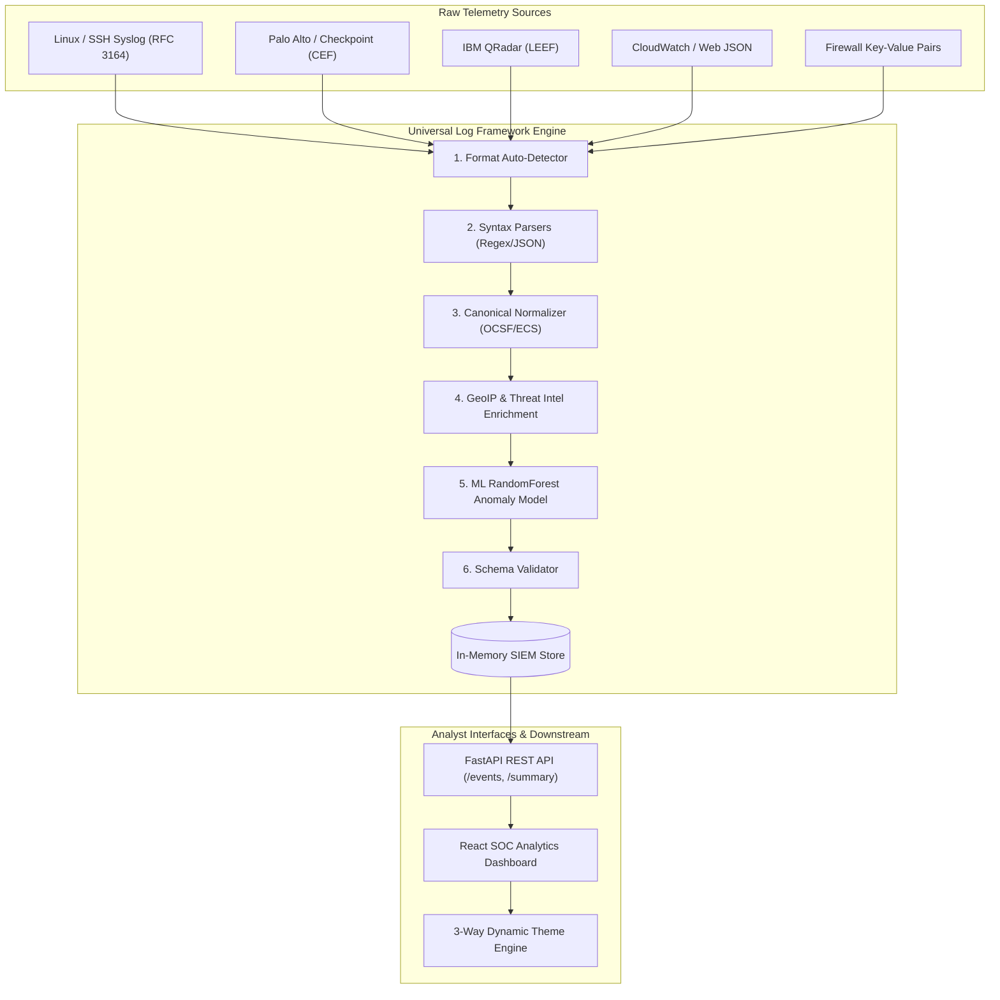
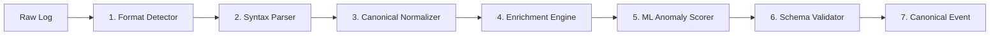
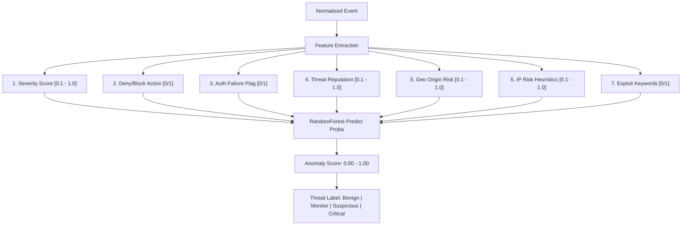

# 🛡️ Universal Log Framework (ULF)
### Heterogeneous Log Normalization • GeoIP & Threat Intel • ML Anomaly Engine

[](https://python.org)
[](https://fastapi.tiangolo.com)
[](https://reactjs.org)
[](https://www.typescriptlang.org)
[](https://vitejs.dev)
[](https://www.docker.com)
[](https://pytest.org)
[](https://sih.gov.in)

---

## 📌 Table of Contents
- [Executive Overview](#-executive-overview)
- [The Problem Statement](#-the-problem-statement)
- [System Architecture](#-system-architecture)
- [The 7-Stage Ingestion Pipeline](#-the-7-stage-ingestion-pipeline)
- [Machine Learning Anomaly Engine](#-machine-learning-anomaly-engine)
- [Dashboard & Visualization Suite](#-dashboard--visualization-suite)
- [Canonical Event Schema](#-canonical-event-schema)
- [REST API Reference](#-rest-api-reference)
- [Getting Started & Local Setup](#-getting-started--local-setup)
- [Docker & Production Deployment](#-docker--production-deployment)
- [Automated Testing](#-automated-testing)
- [Contributing & License](#-contributing--license)

---

## 🚀 Executive Overview

The **Universal Log Framework (ULF)** is a modern, high-throughput cybersecurity log processing and intelligence platform. It bridges the gap between disparate network appliances, firewalls, operating systems, and cloud providers by providing a unified normalization layer combined with real-time threat intelligence and a machine learning anomaly classifier.

### 🌟 Core Highlights
- **Vendor-Agnostic Format Detection**: Instantly detects and parses **Syslog (RFC 3164/5424)**, **CEF (ArcSight / Palo Alto)**, **LEEF (IBM QRadar)**, **Key-Value**, and structured **JSON** logs.
- **Canonical Schema Harmonization**: Transforms unstructured and semi-structured fields into an **OCSF / Elastic Common Schema (ECS)** compliant JSON structure.
- **Contextual Enrichment**: Automatically resolves IP addresses to country codes, geographic risk scores, and reputation threat indicators in real time.
- **Machine Learning Threat Scoring**: Utilizes a trained `scikit-learn` **RandomForest Classifier** to assign probability risk scores (`0.00` to `1.00`) and verdict classifications (`benign`, `monitor`, `suspicious`, `critical`).
- **Interactive SOC Dashboard**: Features a 3-way theme switcher (**Light / White Mode**, **Dark Mode**, and **Cyber / Color Mode**), radial SVG threat gauges, time-series area charts, severity donut charts, and slide-out log inspection drawers.

---

## ⚡ The Problem Statement

Security Operations Centers (SOCs) in enterprise environments ingest millions of raw logs daily from firewalls, web servers, Linux/Windows endpoints, databases, and microservices:
1. **Format Fragmentation**: Incompatible field names (e.g., `src`, `src_ip`, `sourceIP`, `c-ip`).
2. **Missing Threat Context**: Raw logs do not contain reputation data, geographic risks, or threat severity indicators.
3. **Rule Exhaustion**: Traditional static regex rules fail against zero-day anomalies and novel attack vectors.
4. **Triage Inefficiency**: Analysts waste valuable incident response time manually correlating inconsistent data formats.

**ULF provides an end-to-end normalization pipeline that converts any raw telemetry into structured, enriched, and ML-scored security intelligence.**

---

## 🏗️ System Architecture



---

## 🔄 The 7-Stage Ingestion Pipeline



| Stage | Module | Description |
| :--- | :--- | :--- |
| **1. Auto-Detection** | `app/detector/format_detector.py` | Fast regex & JSON validation identifying Syslog, CEF, LEEF, Key-Value, or JSON. |
| **2. Syntax Parsing** | `app/parser/` | Extracts vendor-specific tokens into structured key-value dictionaries. |
| **3. Canonical Mapping** | `app/normalizer/normalizer.py` | Normalizes keys into standard `event.*`, `network.*`, `host`, and `metadata`. |
| **4. Context Enrichment** | `app/enrichment/` | Injects ISO country codes, city data, and threat reputation (`suspicious`/`benign`). |
| **5. ML Anomaly Scoring**| `app/ml/anomaly_model.py` | Calculates a 7-dimensional feature vector and predicts anomaly probability score. |
| **6. Verification** | `app/validator/validator.py` | Ensures required timestamps, schema integrity, and data types. |
| **7. SIEM Dispatch** | `app/main.py` | Appends event to the active buffer and broadcasts to REST/WebSocket consumers. |

---

## 🧠 Machine Learning Anomaly Engine

Located in [`app/ml/anomaly_model.py`](file:///Users/anubhavkumar/sih/universal-log-framework/app/ml/anomaly_model.py), the ML component is powered by a **RandomForest Classifier**:

```python
RandomForestClassifier(n_estimators=100, random_state=42, class_weight='balanced')
```

### 7-Dimensional Feature Vector ($X$)

```
X = [ SeverityScore, DenyActionScore, AuthFailureScore, ReputationScore, GeoRiskScore, IPRiskScore, KeywordPayloadScore ]
```



### Classification Verdict Thresholds
- 🟢 **Benign (`0.00 - 0.29`)**: Normal internal traffic and routine telemetry.
- 🟡 **Monitor (`0.30 - 0.54`)**: Mild policy anomaly or non-standard outbound traffic.
- 🟠 **Suspicious (`0.55 - 0.79`)**: Repeated authentication failures, anomalous deny rules, or unverified external sources.
- 🔴 **Critical (`0.80 - 1.00`)**: Active C2 beaconing, exploit payloads, or malicious IOC connections.

---

## 📊 Dashboard & Visualization Suite

The frontend is built with **React 18 + TypeScript + Vite** for instantaneous responses and zero-lag rendering.

```
┌──────────────────────────────────────────────────────────────────────────────┐
│ UNIVERSAL LOG FRAMEWORK              [ CORE ONLINE | 2ms ]  [ Light|Dark|Color ]│
├──────────────┬───────────────────────────────────────────────────────────────┤
│ 🏠 Home      │  ┌───────────────┐ ┌───────────────┐ ┌──────────────────────┐ │
│ 📊 Dashboard │  │ Total Events  │ │ Blocked Events│ │ Average ML Risk      │ │
│ 🧪 Studio    │  │     1,420     │ │      384      │ │   0.78 (CRITICAL)    │ │
│ 🗄️ Explorer  │  └───────────────┘ └───────────────┘ └──────────────────────┘ │
│ 📡 Pulse     │  ┌───────────────────────────────┐ ┌────────────────────────┐ │
│ ⚙️ ML Engine │  │ Threat Risk Radial Gauge      │ │ Severity Breakdown     │ │
│ 📖 API Docs  │  │        [ 78% CRITICAL ]       │ │  Donut Chart (SVG)     │ │
│              │  └───────────────────────────────┘ └────────────────────────┘ │
│              │  ┌──────────────────────────────────────────────────────────┐ │
│ [Telemetry]  │  │ Live Event Timeline (Interactive Spline Area Chart)      │ │
│ fw-edge-01   │  └──────────────────────────────────────────────────────────┘ │
└──────────────┴───────────────────────────────────────────────────────────────┘
```

### Dashboard Views
1. **Landing Page & Live Playground**: Interactive tester with instant format detection chips and sample presets.
2. **SOC Analytics Dashboard**:
   - **Radial Threat Gauge**: Real-time ML anomaly score gauge with color transitions.
   - **Event Timeline Area Chart**: Time-series SVG spline chart displaying volume trends.
   - **Severity Donut Chart**: Interactive slice highlighting with percentage breakdown.
   - **Sources Bar Chart & Geo Threat Map**: Country origin risks and active input streams.
3. **Pipeline Ingestion Studio**: Live raw log editor, batch file uploader, and step-by-step pipeline validation visualizer.
4. **SIEM Event Explorer**: Searchable, filterable event table with slide-over detailed log drawer and raw JSON viewer.
5. **Security Pulse**: Live incident feeds, high-risk assets, and active security advisories.
6. **ML Decision Engine**: Feature importance weights and model explainability indicators.
7. **3-Way Theme Switcher**:
   - ☀️ **Light Mode**: Modern, human-crafted crisp white UI with slate borders.
   - 🌙 **Dark Mode**: Cyber SOC dark canvas with neon metrics.
   - 🎨 **Color Mode**: StarAdmin Sunset Coral & Obsidian navy palette.

---

## 📄 Canonical Event Schema

Every ingested log is normalized into this consistent JSON structure:

```json
{
  "timestamp": "2026-08-31T09:15:00Z",
  "source": "palo_alto_firewall",
  "host": "fw-gateway-01",
  "event_type": "threat_prevention",
  "severity": "critical",
  "message": "C2 beaconing signature matched on outbound flow",
  "event": {
    "action": "blocked",
    "severity": "critical",
    "type": "threat",
    "message": "C2 beaconing signature matched"
  },
  "network": {
    "source_ip": "1.2.3.4",
    "destination_ip": "10.0.0.12",
    "source_port": 443,
    "destination_port": 58920,
    "protocol": "TCP"
  },
  "enrichment": {
    "country": "CN",
    "country_name": "China",
    "city": "Beijing",
    "geo_risk_score": 0.95
  },
  "threat": {
    "reputation": "suspicious",
    "indicator": "known_c2_node",
    "ml_anomaly_score": 0.88,
    "verdict": "critical"
  },
  "metadata": {
    "device_vendor": "Palo Alto Networks",
    "device_product": "PAN-OS"
  },
  "raw_log": "CEF:0|Palo Alto|PAN-OS|11.0|THREAT|C2-Beacon|10|src=1.2.3.4 dst=10.0.0.12 dpt=58920 spt=443 act=blocked"
}
```

---

## 🔌 REST API Reference

The backend exposes a fully documented REST API. Interactive Swagger UI is available at [`/docs`](http://localhost:8000/docs).

| Method | Endpoint | Description |
| :--- | :--- | :--- |
| `GET` | `/` | Serves the compiled React Frontend Single Page Application |
| `GET` | `/health` | System health, uptime metrics, and service status |
| `GET` | `/summary` | High-level metrics (total events, blocked count, high severity count) |
| `GET` | `/overview` | Aggregated SOC dashboard payload (alerts, incidents, assets, events) |
| `GET` | `/events` | Returns all normalized events in the SIEM store |
| `GET` | `/ml/insights` | ML model summary, average anomaly score, and threat label |
| `POST`| `/ingest` | Ingests and normalizes a single raw log payload |
| `POST`| `/ingest/batch` | Batch ingests an array of raw log strings |
| `POST`| `/events/clear` | Resets the in-memory event buffer |

### Quick cURL Examples

```bash
# 1. Ingest a raw CEF log
curl -X POST http://localhost:8000/ingest \
  -H "Content-Type: application/json" \
  -d '{"log":"CEF:0|Palo Alto|PAN-OS|11.0|THREAT|Suspicious Traffic|8|src=1.2.3.4 dst=10.0.0.12 act=blocked msg=c2-beacon"}'

# 2. Ingest a raw Syslog line
curl -X POST http://localhost:8000/ingest \
  -H "Content-Type: application/json" \
  -d '{"log":"Aug 31 09:00:00 web-01 sshd[1234]: Failed password for invalid user admin from 192.168.1.50 port 22 ssh2"}'

# 3. Retrieve ML Anomaly Insights
curl http://localhost:8000/ml/insights

# 4. Fetch Security Summary
curl http://localhost:8000/summary
```

---

## 💻 Getting Started & Local Setup

### Prerequisites
- **Python 3.10+** (with `pip`)
- **Node.js 18+** (with `npm`)

### ⚡ Single Command Runner (Recommended)

Run both the FastAPI Backend (`:8000`) and the Vite React Frontend (`:5173`) simultaneously:

```bash
# 1. Clone the repository
git clone https://github.com/Anubhavgithub3/SIH.git
cd SIH/universal-log-framework

# 2. Install dependencies & run both servers
npm run dev
```

- 🌐 **Frontend Dashboard**: Open 👉 [http://localhost:5173](http://localhost:5173)
- 🔌 **FastAPI Backend**: Open 👉 [http://localhost:8000](http://localhost:8000)
- 📖 **Interactive Swagger UI**: Open 👉 [http://localhost:8000/docs](http://localhost:8000/docs)

---

## 🐳 Docker & Production Deployment

### Run with Docker Compose
```bash
docker compose up --build
```
Access the unified application at [http://localhost:8000](http://localhost:8000).

### Deploying to Render Cloud
This repository includes a multi-stage `Dockerfile` and `render.yaml` blueprint:
1. Connect your GitHub repository to [Render](https://render.com).
2. Choose **Web Service** with **Runtime: Docker**.
3. Render automatically executes the multi-stage build:
   - **Stage 1**: Compiles React TypeScript assets with `node:20-alpine`.
   - **Stage 2**: Packages Python 3.12, installs requirements, and serves the app via `uvicorn`.

---

## 🧪 Automated Testing

The test suite validates format detection, syntax parsers, normalization accuracy, API contracts, and ML scoring.

```bash
# Run tests
pytest -q
```

### Test Coverage Results:
```text
tests/test_pipeline.py ...................                           [100%]
19 passed in 2.45s
```

- ✅ Syslog RFC 3164 parser accuracy
- ✅ CEF Palo Alto token parsing
- ✅ LEEF IBM QRadar normalization
- ✅ JSON CloudWatch event validation
- ✅ Key-Value firewall drop parsing
- ✅ GeoIP & Threat Intel enrichment
- ✅ ML Anomaly probability score thresholds
- ✅ FastAPI endpoint responses & schema validation

---

## 👥 Contributors & License

- **Project**: Universal Log Framework (ULF)
- **Initiative**: Smart India Hackathon (SIH 2026) Innovation
- **License**: MIT License - Free for educational, research, and enterprise demonstration use.
